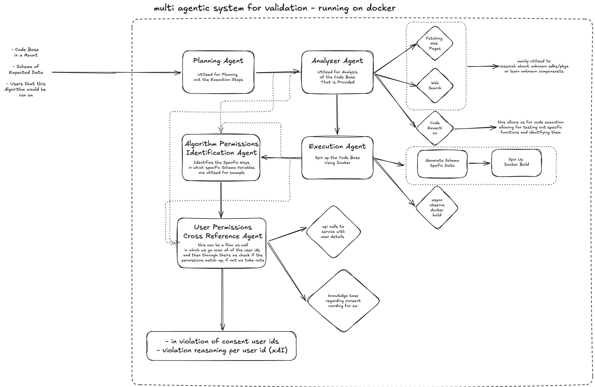

# approach

to handle this a multi-agentic system (MAS) is proposed- it uses generative ai to provide a validation framework for the algorithms organizations want to execute with user data.

## the multi-agentic system

the validation is orchestrated through a composition of specialized ai agents, each leveraging distinct model capabilities for different validation phases.

### planning agent

uses an advanced reasoning model to decompose the validation task and outline execution steps for the remaining agents. it structures the overall workflow and ensures coherent sequencing of analysis and verification tasks- basically the orchestrator that makes sure everything runs in the right order.

### analyzer agent

deployed using a model with a large context window to perform fine-grained build-time analysis of the provided codebase. this agent handles code inspection, identifying external dependencies, and understanding algorithmic behavior.

it has access to:
- web search and page fetching- for researching unknown dependencies, sdks, or packages
- code execution- to test and verify specific functions in isolation and identify their behavior

so it's not just reading code- it can actually look things up and run stuff to understand what the algorithm is doing.

### execution agent

manages runtime validation within a containerized environment. it:

- instantiates a docker build of the codebase
- uses the provided schema to generate schema-specific test data
- executes the algorithm under observed conditions
- asynchronously observes the running docker build using system-level observability tooling to capture computational resource usage, syscalls, and network activity

the codebase exposes a singular entry point- either a cli call or an http endpoint- which the agent invokes to exercise the algorithm's runtime behavior. all observations get collected for downstream synthesis.

### algorithm permissions identification agent

focuses specifically on the codebase's permission and data access profile. it takes the combined output of both the analyzer agent and the execution agent- covering static code analysis and observed runtime behavior- and identifies the specific ways schema variables are accessed and utilized.

this means determining what data fields are read, written, or transmitted, and under what conditions. the output is a structured mapping of the algorithm's actual data access and permission requirements, which gets passed downstream for per-user cross-referencing.

### user permissions cross-reference agent

operates as a per-user validation flow. for each user in the provided list, this agent:

1. fetches the user's consent agreement from the gdpr system- the original document the organization provided to the user detailing what data would be collected and for what purposes
2. cross-references it against the structured permission and data access requirements from the algorithm permissions identification agent

to support accurate interpretation of consent language and wording, this agent is backed by a knowledge base (rag) of consent form understanding- covering common phrasing, legal wording patterns, and purpose categorizations. this lets it reason correctly about what a given consent agreement does and does not cover.

the agent checks not only whether the required data fields are covered by the user's consent, but whether the *purpose* of their use in the algorithm aligns with what was actually consented to. if an algorithm uses an email field to send marketing content, the agent verifies that the user's consent explicitly covers use of their email for marketing purposes- not just that an email permission exists.

this runs per user and the output is updated incrementally- any user whose consent doesn't cover the algorithm's requirements gets flagged as a violation, along with the specific reasoning behind it. if all users pass, the algorithm is considered valid.

## why this layered approach

separating concerns across analysis phases- static code analysis, runtime observation, and per-user consent cross-referencing- gives comprehensive coverage while keeping things modular and auditable. each agent has a clear responsibility and the outputs chain together cleanly.
