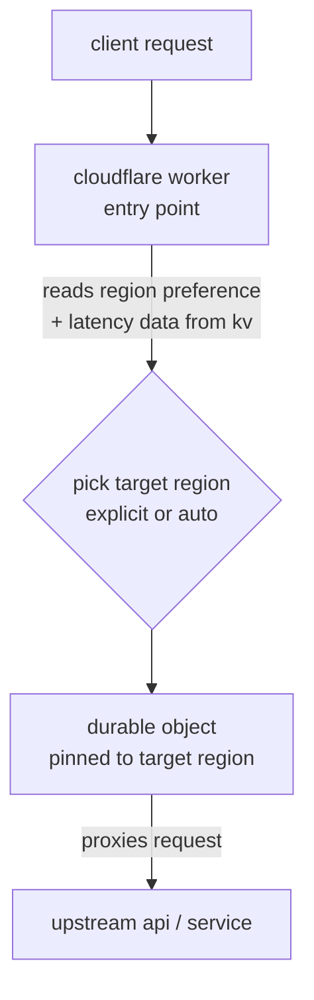
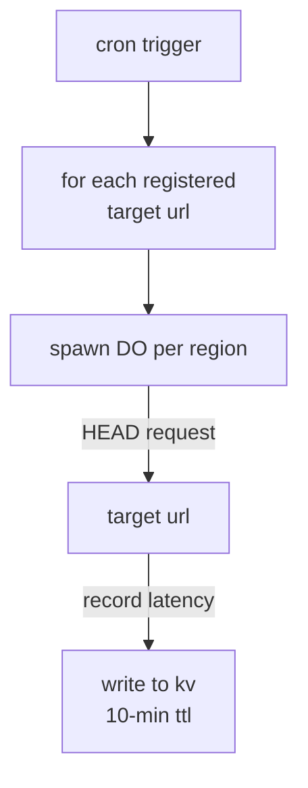
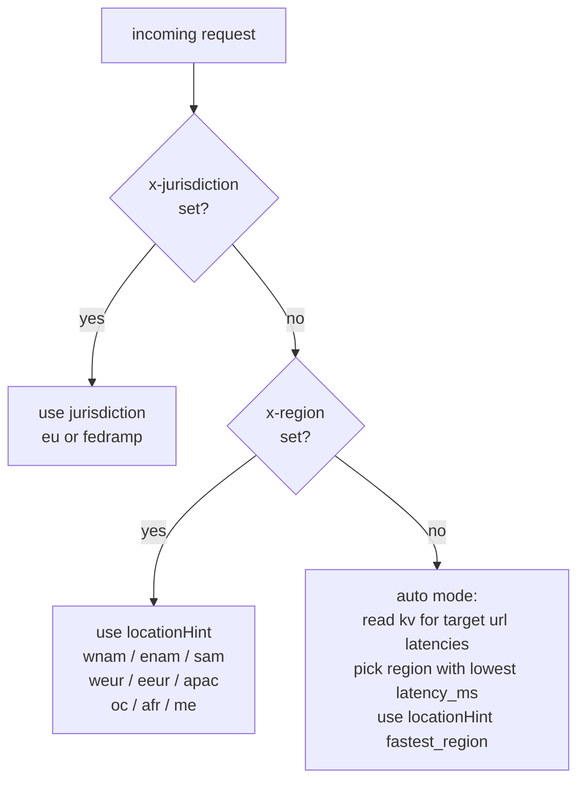
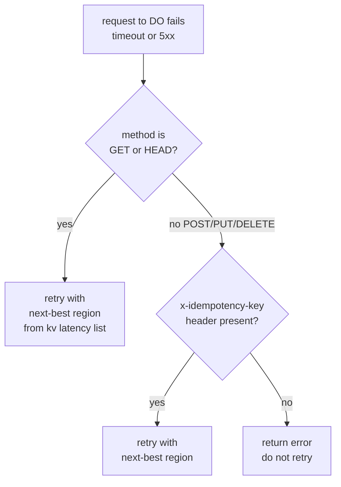

# technical design

## tech stack

| layer | technology |
|---|---|
| runtime | cloudflare workers |
| region routing | durable objects (location hints + jurisdictions) |
| latency store | cloudflare kv |
| background monitoring | cloudflare cron triggers |
| framework | bare cloudflare workers api (no framework needed at this scale) |

## architecture overview



background - every 1 min:



## components

### worker (entry point)

the main worker handles incoming requests. it:

1. reads the `x-region` header (or `region` query param) to get the desired region code
2. reads the `x-jurisdiction` header if a jurisdiction override is set
3. if auto mode: reads kv to find the region with the lowest latency for the target
4. instantiates a durable object with the correct location hint / jurisdiction
5. passes the full request to the do for proxying
6. on failure: checks if the request is retryable, picks the next-best region from kv, retries

### durable object - `RegionProxy`

one do per request (not persistent state). the do is instantiated with a location hint matching the target region, which places it on cloudflare's edge close to that region's data center.

the do:
- receives the proxied request
- makes a `fetch()` to the upstream url with the original headers and body
- streams the response back to the worker
- records actual latency for passive tracking (nice to have)

do creation with location hint:

```js
const id = env.REGION_PROXY.newUniqueId();
const stub = env.REGION_PROXY.get(id, { locationHint: "enam" });
```

do creation with jurisdiction:

```js
const stub = env.REGION_PROXY.jurisdiction("eu").get(id);
```

### kv - latency store

kv key structure:

```
latency:{url_hash}:{region_code}
```

value structure:

```json
{
  "region": "enam",
  "latency_ms": 42,
  "measured_at": "2026-04-12T11:00:00Z"
}
```

ttl: 10 minutes. refreshed each time the cron runs (kv put with `expirationTtl: 600`).

auto-routing reads all keys for the target url hash, compares latency values, and picks the lowest.

### cron trigger - latency monitor

runs every minute via cloudflare's cron trigger.

for each registered target url:
1. iterate over all supported region codes (`wnam`, `enam`, `sam`, `weur`, `eeur`, `apac`, `oc`, `afr`, `me`)
2. spawn a durable object with `locationHint` set to that region
3. issue a `HEAD` request to the target url from inside that do
4. record round-trip time in ms
5. write to kv with 10-min ttl

```js
// wrangler.toml
[triggers]
crons = ["* * * * *"]
```

registering target urls: the cron reads a kv key `monitored_urls` (a json array of urls) to know what to probe.

## request routing flow



## retry flow



max retries: cycle through up to 3 regions before giving up.

## supported region codes

| code | location |
|------|----------|
| wnam | western north america |
| enam | eastern north america |
| sam | south america |
| weur | western europe |
| eeur | eastern europe |
| apac | asia-pacific |
| oc | oceania |
| afr | africa |
| me | middle east |

jurisdiction options: `eu`, `fedramp`

## deployment

standard cloudflare workers deployment via wrangler. requires:
- a durable object namespace (`REGION_PROXY`)
- a kv namespace (`LATENCY_KV`)
- cron trigger configured in `wrangler.toml`
- `monitored_urls` key seeded in kv with the list of urls to probe

no external services, no databases, no servers. fully serverless on cloudflare's infrastructure.
