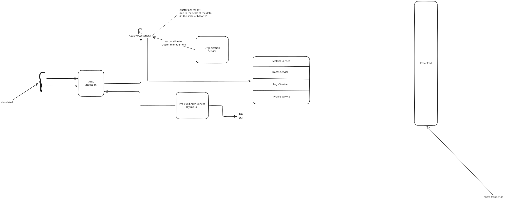
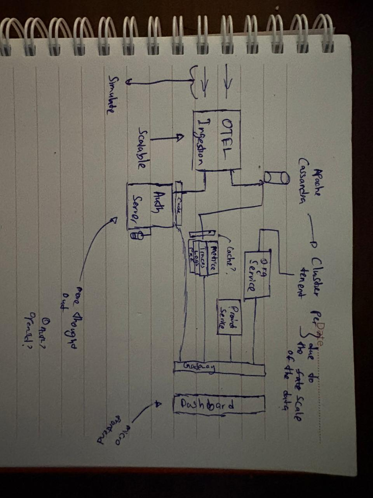

# RecTel: Recreational OpenTelematary (OTEL)

this is a re creation of a OTEL system, built out mainly for the purpose of understanding how K8s and scaling works within it, and for me to mess around with some other technology i wanna try out such as Apache Casandara, Go Lang, Micro Frontends, etc...

the following is the current architecture diagram:

