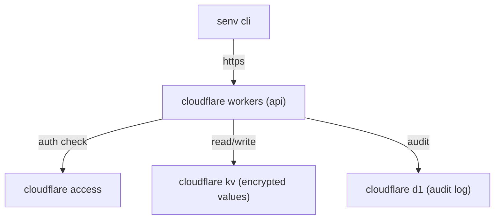
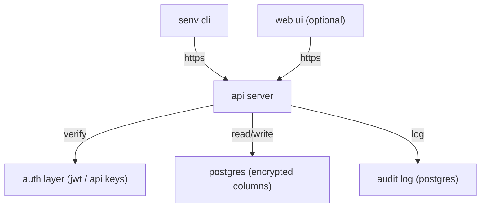

# technical design

> this is a work in progress- approach hasn't been finalized yet. two architectures are being considered before committing to one.

## approach comparison

### approach a: cloudflare-native



| layer | technology |
|---|---|
| api | cloudflare workers |
| storage | cloudflare kv |
| auth | cloudflare access |
| audit log | cloudflare d1 |
| client | cli (language tbd) |

**tradeoffs**
- no infra to manage- all cloudflare's problem
- global edge, built-in ddos protection
- vendor lock-in to cloudflare
- cost model can get unpredictable at scale
- less flexibility in auth and storage design

---

### approach b: docker-based (current lean)



| layer | technology |
|---|---|
| api | rest api server (language tbd) |
| storage | postgres with encrypted columns |
| auth | jwt or api keys (tbd) |
| audit log | postgres |
| client | cli (language tbd) |
| deployment | docker / docker-compose |

**tradeoffs**
- runs anywhere docker runs, fully portable
- you own the data and infra
- more to set up and maintain
- auth and encryption are your responsibility to get right

---

## cli design (both approaches)

the cli is the primary interface. core commands:

```
senv pull <project> [--env <environment>] [--output .env]
senv push <project> <key> <value> [--env <environment>]
senv rotate <project> <key>
senv list <project>
senv projects
```

`senv pull` generates a `.env` file locally so existing tooling keeps working unchanged.

## encryption approach (docker)

env values are encrypted before storage. two options being considered:

- **application-level encryption**: api server encrypts/decrypts before reading from and writing to the db. simpler, encryption key lives in the server config.
- **column-level encryption**: postgres `pgcrypto` handles it at the db layer. more transparent but less portable across db engines.

key management (where the encryption key itself lives) is tbd- likely a secret injected at runtime via env (yes, the irony).

## access control model

- **projects** - top-level grouping, maps to a codebase or app
- **environments** - per-project (dev, staging, prod)
- **users / service accounts** - have access to projects, optionally scoped to specific environments

minimum viable: project-level access (either you have it or you don't). finer-grained (per-key, per-env) is a future concern.

## audit log

every read and write gets logged:
- who (user / service account)
- what (key name, project, environment)
- when (timestamp)
- action (read, write, rotate)

stored in the same db for now. could be split out later if volume warrants it.

## what's not finalized

- which approach to build
- programming language for the api server and cli
- auth mechanism (jwt vs api keys vs oauth)
- encryption key management
- web ui (optional, lower priority)
